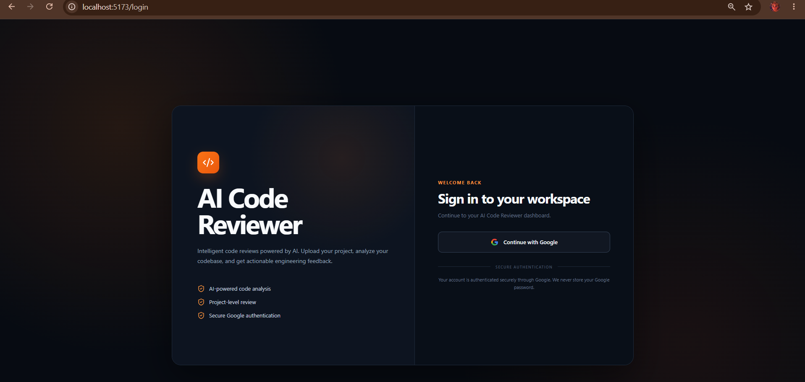
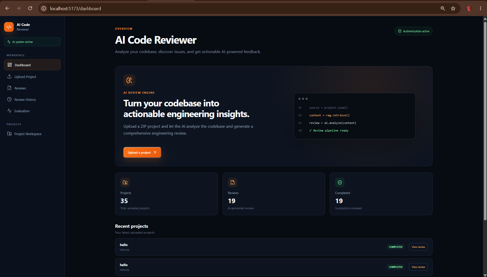
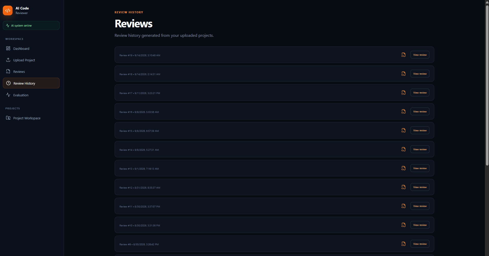
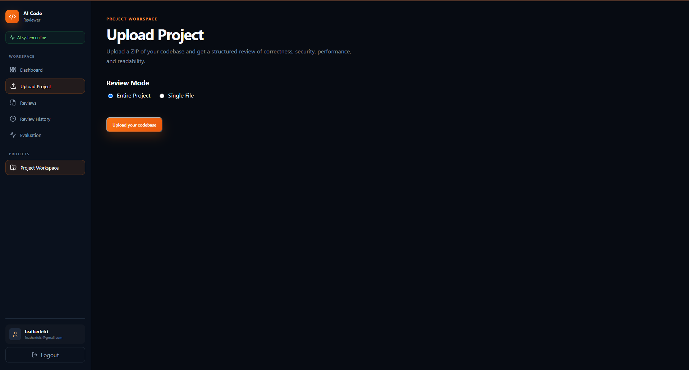
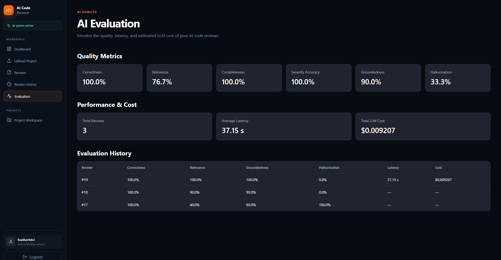

# AI Code Reviewer — Project Overview

AI Code Reviewer is a full-stack web application that allows developers to upload a ZIP-based source code project and generate an AI-powered code review.

The system uses a Retrieval-Augmented Generation (RAG) pipeline to retrieve relevant source-code context before sending it to Google Gemini. Reviews are persisted in PostgreSQL and automatically evaluated using an LLM-as-a-Judge evaluation layer.

# Tech Stack
Frontend - React, Vite, React Router, Axios
Backend -	Python 3.11, FastAPI, Pydantic
Database - PostgreSQL, SQLAlchemy
Authentication - Google OAuth/OIDC, session cookies
RAG - LangChain, ChromaDB
Embeddings - Hugging Face all-MiniLM-L6-v2
LLM - Google Gemini
Container - Docker
Cloud/K8s	Planned

Review Modes

The application supports two review modes.

1. Entire Project Review

The complete uploaded project is processed.
The system:
Extracts the ZIP
Reads supported source files
Splits source code into chunks
Generates embeddings
Stores chunks and metadata in ChromaDB
Retrieves relevant project context
Generates an AI code review

2. Single File Review

The user can select a specific source file from the uploaded ZIP.
The frontend reads the ZIP using JSZip and displays supported source files for selection.
The selected file is then sent to the backend using:
review_mode=file
selected_file=<filename>

The backend validates that the selected file actually exists in the uploaded project before processing it.

# Product Flow
User
 ↓
React UI
 ↓
Google Login
 ↓
FastAPI
 ↓
Session authentication
 ↓
Upload ZIP
 ↓
Extract + read source files
 ↓
LangChain splits code into chunks
 ↓
Hugging Face creates embeddings
 ↓
ChromaDB stores chunks + vectors + project_id
 ↓
Retriever gets relevant project chunks
 ↓
LangChain Prompt
 ↓
Gemini
 ↓
AI Review
 ↓
PostgreSQL stores review
 ↓
review_id returned to React
 ↓
React requests /review/{review_id}
 ↓
Review displayed in UI

# AI Evaluation

LLM-as-a-Judge Evaluation
 ├── Correctness
 ├── Relevance 
 ├── Completeness 
 ├── Severity Accuracy 
 ├── Groundedness 
 └── Hallucination 
 ↓ Latency + LLM Cost Tracking 
 ↓ PostgreSQL 
    └── Evaluation

# Pages & Functionality
Login : Google OAuth/OIDC login

Dashboard : Overview of projects and reviews

Upload : Upload ZIP source-code projects
[text](README.md)  

Review : Display AI-generated code review

History : Display previous code reviews, Access individual review results
[text](README.md) 
AI Evaluation: Display AI review quality metrics:

# How to Test Locally

1. Start PostgreSQL.

2. Start backend: python -m uvicorn app.main:app --reload

Backend: http://localhost:8000

Swagger: http://localhost:8000/docs

3. Start frontend:

npm install
npm run dev

Frontend:

http://localhost:5173

4. Test the product: 
Open:  http://localhost:5173
Then:

# Docker Test
Build: 
docker build -t ai-code-reviewer .

Run:
docker run --name ai-code-reviewer `
  --env-file .env `
  -p 8000:8000 `
  -v ai-code-reviewer-chroma:/app/data/chroma `
  ai-code-reviewer

Then use the same frontend at:
http://localhost:5173

# Key Architecture Concept

PostgreSQL stores application data such as users, projects, and reviews.

ChromaDB stores code chunks, embeddings, and metadata for semantic retrieval.

LangChain connects the RAG components; Hugging Face creates embeddings, and Gemini generates the final review.